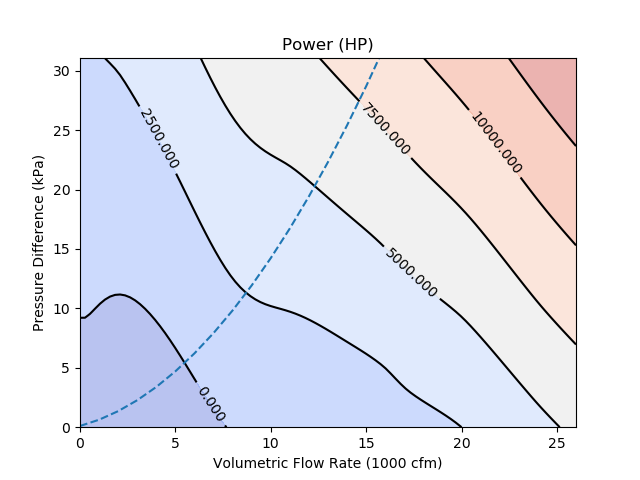

# Air-Cycle Refrigeration System Optimization

Thermodynamic modeling and optimization of a Brayton cycle air refrigeration 
system with integrated fan performance curves and heat exchanger sizing.

## Overview

This project demonstrates systems-level thermal-fluid modeling for an 
industrial refrigeration unit. The system uses air as the working fluid 
in a reverse Brayton cycle to provide 60 kW of cooling.

## Key Features

- **Thermodynamic cycle simulation**: Ideal gas Brayton cycle with real air properties
- **Pipe network modeling**: Darcy-Weisbach friction factor, major head losses
- **Fan integration**: Performance curves from manufacturer data using RBF interpolation
- **Heat exchanger sizing**: Effectiveness calculations and area requirements
- **System optimization**: Minimize net work input via Powell's method

## Technical Approach

The model includes:
- Isentropic compression and expansion with efficiency factors
- Pressure drops through piping network (20-40m of ductwork)
- High and low temperature heat exchangers
- Fan power consumption based on volumetric flow and pressure rise
- Constraint handling for physical feasibility

The full mathematical details are available in [artifacts/report.pdf](artifacts/report.pdf)

## Results

Based on these assumed fan curves



we find an optimal system optimized to provide 100 kW of cooling with air as a refrigerant:

| Parameter | Value | 
|-----------|-------|
| Net work input | 121.5 kW |
| Pressure ratio | 6.52 |
| Mass flow rate | 0.96 kg/s |
| High-temp HX area | 0.13 m² |
| Low-temp HX area | 0.14 m² |

Optimization reduced work requirement by 87% compared to initial design 
(from 938 kW to 121 kW) by optimizing pipe diameters, pressure ratios, 
and flow distribution.

Key temperatures:
- Compressor outlet: 470 K (197°C)
- After heat rejection: 293 K (20°C)  
- After expansion: 171 K (-102°C)
- Refrigerated space: 275 K (2°C)

## Relevance to Industrial Thermal Systems

While developed for refrigeration, this modeling framework applies directly 
to industrial heat delivery systems where air flows through thermal media:
- Thermodynamic property calculations across wide temperature ranges
- Fan-driven air handling with pressure drop constraints  
- Heat exchanger performance modeling
- System-level optimization with multiple design variables

This work was completed during my Masters of Science degree at University of Colorado Boulder (2017-2019).

## Usage
```python
python optimize.py  # Run full system optimization
python fan_curves2.py  # Generate fan performance curves
```

## Dependencies

- Python 2.7
- numpy, scipy, matplotlib, pandas
